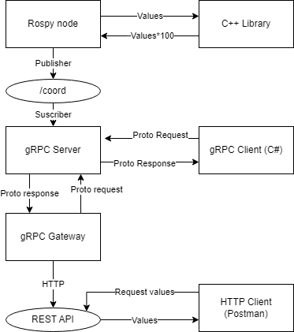
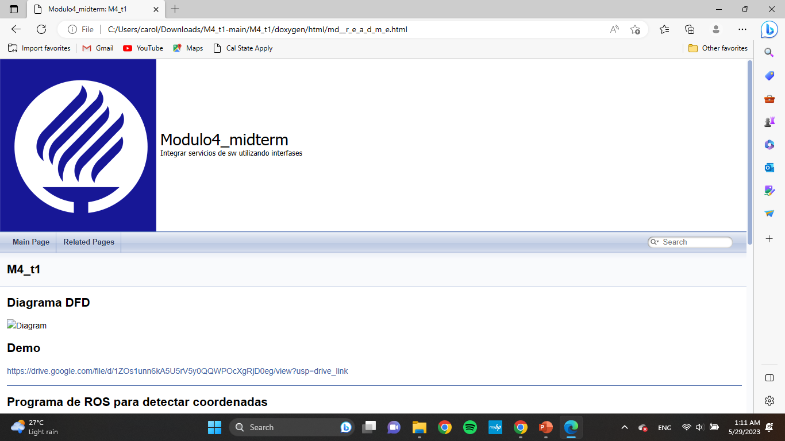

# M4_t1
Integrando servicios de SW utilizando interfases

### Diagrama DFD


### Demo
https://drive.google.com/file/d/1ZOs1unn6kA5U5rV5y0QQWPOcXgRjD0eg/view?usp=drive_link

---
### Programa de ROS para detectar coordenadas
```
rosrun t1 detectCoord.py
```
Cambiar el path de la libreria en detectCoord.py

### Servidor gRPC
```
virtualenv -p python3 env
source env/bin/activate
pip install grpcio grpcio-tools
python3 wrapper.py
```

### Cliente gRPC en C#
```
/home/noemi/.nuget/packages/grpc.tools/1.2.2/tools/linux_x64/protoc -I ./ -I /home/noemi/protobuf/src --csharp_out ./ ./rpc.proto --grpc_out ./ --plugin=protoc-gen-grpc=/home/noemi/.nuget/packages/grpc.tools/1.2.2/tools/linux_x64/grpc_csharp_plugin
mono cliente_cs.exe
```

### gRPC Gateway
```
go install github.com/grpc-ecosystem/grpc-gateway/v2/protoc-gen-grpc-gateway
go install github.com/grpc-gateway/v2/protoc-gen-openapiv2
go install google.golang.org/protobuf/cmd/protoc-gen-go
go install google.golang.org/grpc/cmd/protoc-gen-go-grpc
protoc -I ./proto -I /home/robotics/data/devel/googleapis --go_out ./proto --go_opt paths=source_relative --go-grpc_out ./proto --go-grpc_opt paths=source_relative rpc.proto
protoc -I ./proto -I /home/robotics/data/devel/googleapis --plugin=protoc-gen-grpc-gateway=/home/robotics/tools/gw/protoc-gen-grpc-gateway-v2.15.2-linux-x86_64 --grpc-gateway_out ./proto --grpc-gateway_opt logtostderr=true --grpc-gateway_opt paths=source_relative rpc.proto
go mod init rest-gw.com/rest-gw
go mod tidy
go build go-gateway.go
```

### Doxygen

Se agregaron comentarios en estilo Doxygen en los siguientes programas:
* multi.cpp
* detectCoord.py
* wrapper.py
* Program.cs
Sin embargo, los archivos protobuf y los archivos grpc creados no pueden ser comentados, por lo que se explica como descargar las dependencias, compilar y ejecutar esos codigos en este README.
