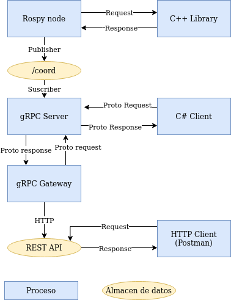

# M4_t1
#### Noemi Carolina Guerra Montiel - A00826944
Integrando servicios de SW utilizando interfases

### Diagrama DFD


### Demo
https://drive.google.com/file/d/1ZOs1unn6kA5U5rV5y0QQWPOcXgRjD0eg/view?usp=drive_link

---
### Programa de ROS para detectar coordenadas
```
rosrun t1 detectCoord.py
```
Cambiar el path de la libreria en detectCoord.py

### Servidor gRPC
```
virtualenv -p python3 env
source env/bin/activate
pip install grpcio grpcio-tools
python3 wrapper.py
```

### Cliente gRPC en C#
```
/home/noemi/.nuget/packages/grpc.tools/1.2.2/tools/linux_x64/protoc -I ./ -I /home/noemi/protobuf/src --csharp_out ./ ./rpc.proto --grpc_out ./ --plugin=protoc-gen-grpc=/home/noemi/.nuget/packages/grpc.tools/1.2.2/tools/linux_x64/grpc_csharp_plugin
mono cliente_cs.exe
```

### gRPC Gateway
```
go install github.com/grpc-ecosystem/grpc-gateway/v2/protoc-gen-grpc-gateway
go install github.com/grpc-gateway/v2/protoc-gen-openapiv2
go install google.golang.org/protobuf/cmd/protoc-gen-go
go install google.golang.org/grpc/cmd/protoc-gen-go-grpc
protoc -I ./proto -I /home/robotics/data/devel/googleapis --go_out ./proto --go_opt paths=source_relative --go-grpc_out ./proto --go-grpc_opt paths=source_relative rpc.proto
protoc -I ./proto -I /home/robotics/data/devel/googleapis --plugin=protoc-gen-grpc-gateway=/home/robotics/tools/gw/protoc-gen-grpc-gateway-v2.15.2-linux-x86_64 --grpc-gateway_out ./proto --grpc-gateway_opt logtostderr=true --grpc-gateway_opt paths=source_relative rpc.proto
go mod init rest-gw.com/rest-gw
go mod tidy
go build go-gateway.go
```

### Doxygen

Se agregaron comentarios en estilo Doxygen en los siguientes programas:
* multi.cpp
* detectCoord.py
* wrapper.py
* Program.cs

<b>
Sin embargo, los archivos protobuf y los archivos grpc creados no pueden ser comentados, por lo que se explica como descargar las dependencias, compilar y ejecutar esos codigos en este README.
</b>

### CORS
El Intercambio de Recusos de Orígen Cruzado (CORS) hace referencia a una característica de seguridad del navegador que restringe las solicitudes HTTP de origen cruzado que se inician desde secuencias de comandos que se ejecutan en el navegador. Cuando un recurso en un dominio intenta hacer una solicitud HTTP a otro dominio, el navegador usualmente impide estas solicitudes por razones de seguridad. Aqui es donde entra CORS al ofrecer una manera de relajar esta política, permitiendo solicitudes entre dominios, siempre y cuando el servidor receptor tenga la configuración adecuada.
Para poder habilitar CORS, es necesario que el servidor envíe encabezados HTTP específicos en las respuetas, indicando los dominios o recursos externos que tienen permiso para acceder al servidor. Algunos ejemplos de estos encabezados son:
* Access-Control-Allow-Origin: Especifica los dominios permitidos.
* Access-Control-Allow-Methods: Indica los metodos de solicitud HTTP permitidos.

CORS tiene un rol importante cuando se desarrollan aplicaciones web con servicios o recursos de diferentes dominios (como API REST), ya que agrega seguridad y control en las solicitudes del navegador. Además, mejora la experiencia del usuario, ya que le permite a la aplicación web realizar solicitudes a dominios externos para mostrar datos en tiempo real, utilizar servicios adicionales e integrar contenidos de terceros. Finalmente, al permitir el acceso a recursos de origen cruzado, las API REST pueden ser utilizadas por varios servicios y aplicaciones, lo cual permite tener capacidad de crecimiento y verstilidad para facilitar la construcción de sistemas modulares y arquitecturas distribuidas.

<b>Referencias</b>

AWS (2023). Habilitación de CORS para un recurso de la API de REST. Recuperado de: https://docs.aws.amazon.com/es_es/apigateway/latest/developerguide/how-to-cors.html.
